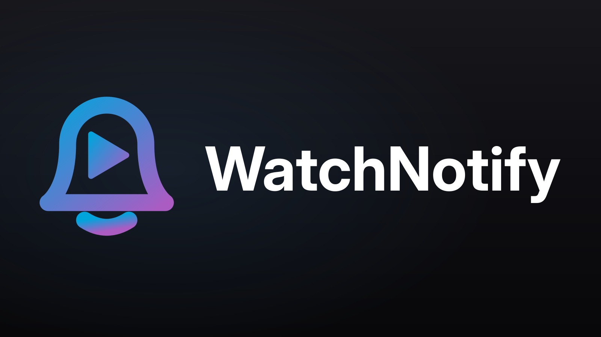

# jellyfin-watchnotify



A Jellyfin server plugin that watches playback events and, when a movie or episode is
watched to completion, fires two actions:

1. **SCN push** — a [Simple Cloud Notifier](https://simplecloudnotifier.blackforestbytes.com/api)
   notification with who / what / start / end / percentage.
2. **Joplin line** — appends a line to a shared watch-log note via a custom Joplin API server.

Everything is configured from the Jellyfin dashboard; there is no external service, no
webhook plugin and no `.env` file.

## Install

Dashboard → Plugins → Repositories → add:

```
https://raw.githubusercontent.com/Mikescher/jellyfin-watchnotify/master/manifest.json
```

Then install **WatchNotify** from the catalogue and restart the server. Requires Jellyfin
10.11 or newer.

## Configuration

Dashboard → Plugins → WatchNotify.

| Setting | Default | Purpose |
|---|---|---|
| Display timezone | `Europe/Berlin` | IANA timezone for rendered watch start/end times |
| Watched threshold | `0.90` | Played fraction that counts as watched |
| Dedup window | `360` min | Duplicate-suppression window per user and item |
| Start coalesce window | `10` min | Seeks within this gap keep the original start time |
| Retry interval | `30` s | Delay between attempts after a failed send |
| Notify on manual mark | off | Also notify when an item is marked played by hand |
| SCN | off | Base url, user id, key, channel, priority, allowed users |
| Joplin | off | Base url, token, note id, anchor, position, empty line gap, request timeout, allowed users |
| Event log size | `500` | Entries kept for the plugin's Log tab |
| Activity log | on | Mirror watched events and failures into Jellyfin's activity log |

Each integration has its own explicit enable checkbox and its own user allowlist, either
"all users" or a set of checkboxes fed by the server's real user list. Joplin needs an
anchor: an empty search would leave the insert position undefined, so an incomplete
configuration is reported on the settings page and skipped at dispatch time.

## "Watched" logic

On playback stop for a Movie or Episode, the item counts as watched when Jellyfin's
`PlayedToCompletion` is true **or** `position / runtime >= watched threshold` (default
`0.90`, matching Jellyfin's own `MaxResumePct`). This tolerates skipped intros and outros.

Some clients report a natural end of file without setting `PlayedToCompletion` and with a
zero position. A second path catches those: when Jellyfin saves user data with reason
`PlaybackFinished` and the item ends up marked played, the watch is notified anyway. That
path runs ten seconds late, because the server saves user data before it raises the stop
event, and shares the dedup ledger with it, so a normal watch is never notified twice.

The watch **start** time comes from the matching playback start event, tracked in memory;
the **end** time is the stop event. Session and dedup state are in-memory and reset on
restart. Notifications are queued per integration and retried until they succeed, so a
failing Joplin never holds up an SCN push.

The Joplin line looks like:

```
[2026-07-18 19:04:22]: The Matrix                    // From Jellyfin [alice]
[2026-07-18 20:04:22]: Firefly [S01E02]              // From Jellyfin [family-acc]
```

## Log

A Joplin insert can take minutes on a busy note. Both integrations therefore have their own
queue and consumer, so a slow watch-log append never delays a push, and the dashboard's test
buttons start the send server-side and poll for its outcome instead of holding the page open.

The plugin's **Log** tab shows a rolling event log — playback starts and stops, watched and
skipped decisions, and every delivery attempt with its error text. It is persisted under
`<data>/watchnotify/events.json`, so it survives a restart. Component logs also land in the
normal server log under `Jellyfin.Plugin.WatchNotify`.

## Development

```sh
make build                                  # compile
make deploy JELLYFIN_CONFIG=~/.config/jellyfin   # drop the dll into a local server
make package                                # build artifacts/watchnotify_<version>.zip
```

`make deploy` writes to `plugins/Jellyfin.Plugin.WatchNotify_<version>/`; a folder without
`meta.json` is still loaded, so no packaging step is needed while iterating. Restart the
server to pick up a new build.

### Logo

`assets/logo.svg` is the source; `assets/logo.png` is the committed 1600×900 render that
ships in the zip and backs the catalogue entry. After editing the svg:

```sh
rsvg-convert -w 1600 -h 900 assets/logo.svg -o assets/logo.png
```

The wordmark is outlined (Adwaita Sans, weight 700), so re-rendering needs no font
installed — but editing the text means redrawing it from a font again.

### Release

```sh
make release VERSION=1.0.1.0 CHANGELOG="what changed"
git add -A && git commit -m "Release 1.0.1.0" && git push
```

The zip lives in `releases/` and `manifest.json` points at the raw file in this repo, so the
zip and its checksum have to be committed together — the build is not byte-reproducible, and
a manifest entry pointing at a differently-built zip fails the install.

Tagging `v<version>` instead runs `.github/workflows/release.yml`, which does the same steps
in CI and additionally attaches the zip to a GitHub release.
